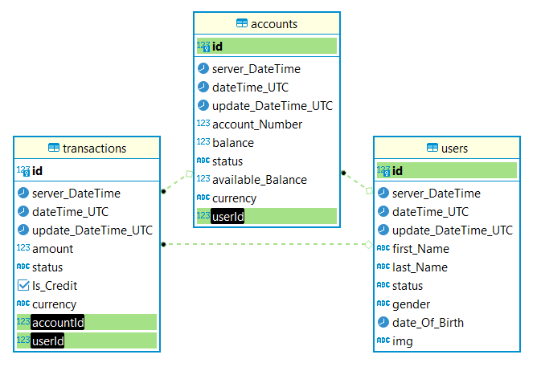

# nummnyServer
# auth-api
[gitHub](https://github.com/alsatarysamah/nummnyServer)

[Railway](https://mstart.up.railway.app/)

a REST API and Web Application using React and SQL Server Database.

# UML

## Routes

## user V1 routes

1-POST /users adds an item to the DB and returns an object with the added item

2-GET /users returns a list of users

3-GET /users/:ID returns a single user by ID

4-PUT /users/:ID returns a single, updated user by ID

5-DELETE /user/:ID delete user by ID  returns an empty object. 

## account routes

1-POST /account  adds an account to the DB and returns an object with the added account

2-GET /account  returns a list of accounts

3-GET /account/:ID  returns a single account by ID

4-PUT /account/:ID  returns a single, updated account by ID

5-DELETE /account/:ID delete account by ID  returns an empty object. 

## tran(transaction) routes

1-POST /tran  adds an tran to the DB and returns an object with the added tran

2-GET /tran  returns a list of trans

3-GET /tran/:ID  returns a single tran by ID

4-PUT /tran/:ID  returns a single, updated tran by ID

5-DELETE /tran/:ID delete tran by ID  returns an empty object. 

