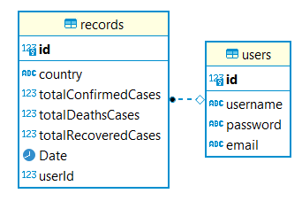

# COVID-19

[gitHub]()

[Railway]()

a REST API using SQL Server Database.

# UML

## Routes

## user V1 routes

1-POST /users adds an item to the DB and returns an object with the added item

2-GET /users returns a list of users

3-GET /users/:ID returns a single user by ID

4-PUT /users/:ID returns a single, updated user by ID

5-DELETE /user/:ID delete user by ID  returns an empty object. 

## record routes

1-POST /record  adds an record to the DB and returns an object with the added record

2-GET /record  returns a list of records

3-GET /record/:ID  returns a single record by ID

4-PUT /record/:ID  returns a single, updated record by ID

5-DELETE /record/:ID delete record by ID  returns an empty object. 

